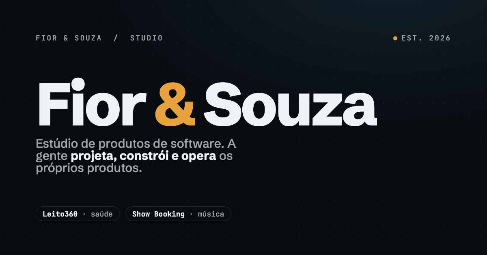

  

# Fior &amp; Souza

**Estúdio de produtos de software.** A gente projeta, constrói e opera os próprios produtos — da UTI ao palco.

O `&` é a sociedade: **Carlos Fior** (clínica &amp; produto) e **Gabriel Souza** (engenharia &amp; plataforma). Junta quem vive o problema com quem constrói a solução.

## Produtos

| Produto | Setor | Status |
|---|---|---|
| **Leito360** | Saúde · UTI | 🟢 Em produção — Hospital Regional Sul |
| **Show Booking** | Música · Booking | 🟠 Em desenvolvimento |

## Como a gente trabalha

- **Produto, não projeto** — constrói, coloca no ar, mede e melhora.
- **Nasce do uso real** — software feito por quem vive o problema.
- **Engenharia que aguenta produção** — tempo real, isolamento de dados, offline.

---

  🌐 <a href="https://fiorsouza.com.br">fiorsouza.com.br</a> &nbsp;·&nbsp; ✉️ ola@fiorsouza.com.br

